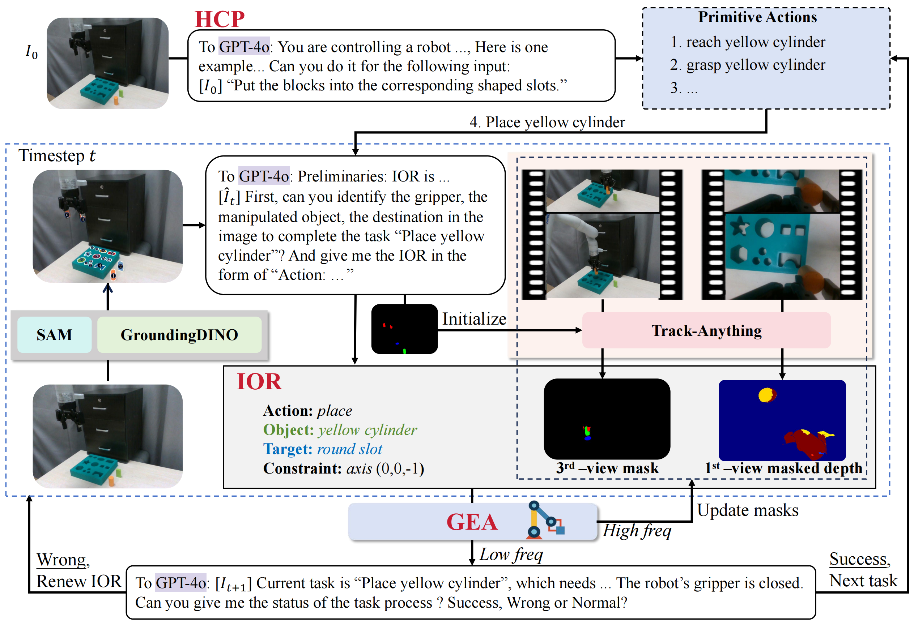

# RoBridge
This repo contains code for the paper:
### RoBridge: A Hierarchical Architecture Bridging Cognition and Execution for General Robotic Manipulation ###

[Project Website](https://abliao.github.io/RoBridge/) || [Arxiv](https://arxiv.org/abs/2505.01709)

<p align="center">

</p>

RoBridge adopts a three-layer architecture, consisting of a high-level cognitive planner (HCP), an invariant operable representation (IOR), and a generalist embodied agent (GEA). For example, for the instruction ``Put the blocks into the corresponding shaped slots", HCP will first plan and split the task into multiple primitive actions. Then, combined with the APIs composed of the foundation model, it will give IOR, which mainly includes the masked depth of the first perspective, the mask of the third perspective, the type of action, and the constraints. IOR is updated by HCP at a low frequency and track-anything updates the mask at a high frequency. IOR is used as the input of GEA, and GEA performs specific actions until the task is completed.

## Abstract
Operating robots in open-ended scenarios with diverse tasks is a crucial research and application direction in robotics. While recent progress in natural language processing and large multimodal models has enhanced robots' ability to understand complex instructions, robot manipulation still faces the procedural skill dilemma and the declarative skill dilemma in open environments. Existing methods often compromise cognitive and executive capabilities. To address these challenges, in this paper, we propose RoBridge, a hierarchical intelligent architecture for general robotic manipulation. It consists of a high-level cognitive planner (HCP) based on a large-scale pre-trained vision-language model (VLM), an invariant operable representation (IOR) serving as a symbolic bridge, and a generalist embodied agent (GEA). RoBridge maintains the declarative skill of VLM and unleashes the procedural skill of reinforcement learning, effectively bridging the gap between cognition and execution. RoBridge demonstrates significant performance improvements over existing baselines, achieving a 75% success rate on new tasks and an 83% average success rate in sim-to-real generalization using only five real-world data samples per task. This work represents a significant step towards integrating cognitive reasoning with physical execution in robotic systems, offering a new paradigm for general robotic manipulation.


## Installation
- Install dependencies
```
git clone https://github.com/abliao/RoBridge
cd RoBridge
path=$(pwd)

pip install -r "$path/real_world/GroundingDINO/requirements.txt"
pip install -r "$path/real_world/Track_Anything/requirements.txt"
cd "$path/gea"
./install.sh
cd "$path"
pip install -r requirements.txt
```
## Training
Please download the [expert agents](https://huggingface.co/D-eon/Robridge) first and put them in `gea/expert_local`. If you want to train by yourself, you can set the corresponding tasks and train in `gea/gea/launch_scripts/metaworld.py`.

Then, train GEA in simulator
```
cd gea
./start.sh
```
If you want to deploy on a real machine, please first collect some real machine data and place it in the `data` folder. Then, run the following command:

```bash
cd gea
python planseqlearn/launch_scripts/finetune.py
```

## Evaluation
To evaluate in simulation, modify the tasks and checkpoints in `gea/gea/launch_scripts/metaworld_eval.py` and run
```bash
cd gea
./eval.sh
```

## Real World 
If you want to run it on a real machine, run
```bash
export PYTHONPATH=.:real_world/Track_Anything
python real_world/main.py --task "put task here"
```
### Note for Real World Deployment
We use a kinova Gen3 robot and two D435i cameras. It is recommended that the closer the camera's pose is to the one in the simulation, the better the effect. Please set the camera's coordinate system in `config/config.yaml`.

## Known Issues
If you have problems compiling the metaworld environment, try running
```
sudo apt-get install build-essential
sudo apt-get install build-essential libgl1-mesa-dev
sudo apt-get install libglew-dev libsdl2-dev libsdl2-image-dev libglm-dev libfreetype6-dev
sudo apt-get install libglfw3-dev libglfw3
```

## Citation
If you find this code useful in your work, please consider citing
```shell
@misc{zhang2025robridgehierarchicalarchitecturebridging,
      title={RoBridge: A Hierarchical Architecture Bridging Cognition and Execution for General Robotic Manipulation}, 
      author={Kaidong Zhang and Rongtao Xu and Pengzhen Ren and Junfan Lin and Hefeng Wu and Liang Lin and Xiaodan Liang},
      year={2025},
      eprint={2505.01709},
      archivePrefix={arXiv},
      primaryClass={cs.RO},
      url={https://arxiv.org/abs/2505.01709}, 
}
```

## Acknowledgements
The project is based on [planseqlearn](https://github.com/mihdalal/planseqlearn), [Track-Anything](https://github.com/gaomingqi/Track-Anything), and [GroundingDINO](https://github.com/IDEA-Research/GroundingDINO). Thanks for the authors for their efforts.
